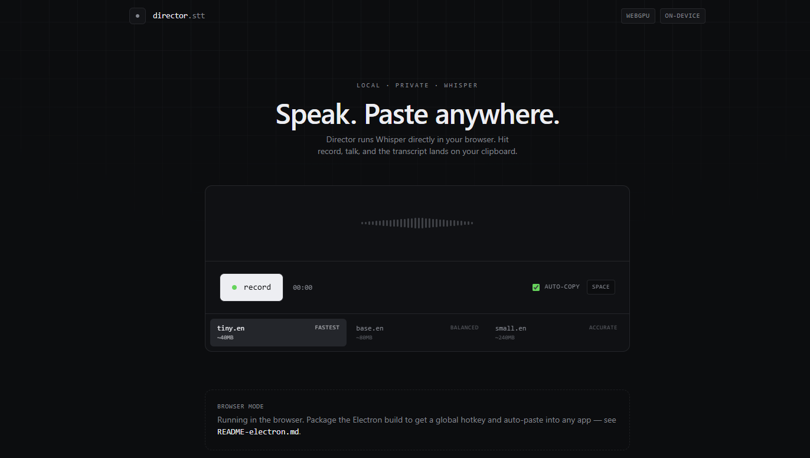

# Director



![npm version][npm-version-badge] ![License][license-badge]

Director is an Electron desktop shell that runs Whisper in the browser. The Electron shell adds:

- **Global hotkey** (default `Cmd/Ctrl+Shift+D`) — summons Director from any app.
- **Auto-paste** — Director hides itself and pastes the transcript into whatever app was previously focused.
- **Same UI, same models** — the desktop shell spawns the nitro production server on `127.0.0.1` and points a `BrowserWindow` at it.

## Quick Start

### One-time setup (Electron build)

```bash
bash scripts/package-electron.sh           # auto-detects current platform
# or explicitly:
bash scripts/package-electron.sh darwin    # macOS
bash scripts/package-electron.sh linux
bash scripts/package-electron.sh win32     # cross-compiles from any host
```

The first run installs `electron` + `@electron/packager` (~150 MB) and writes the packaged app to `./electron-release/Director-<platform>-x64/`.

### Run during development

```bash
npx vite build                  # produce .output/ (nitro)
npx electron electron/main.cjs  # launches the shell against the local build
```

## Platform notes for auto-paste

- **macOS** — uses AppleScript. The first run will prompt to grant _System Settings → Privacy & Security → Accessibility_ permission to Director (or to the terminal, when running unpackaged).
- **Windows** — uses PowerShell `SendKeys`. No extra setup.
- **Linux** — requires `xdotool` (X11) or `wtype` (Wayland) on `PATH`.

## Customizing the hotkey

Set `DIRECTOR_HOTKEY` before launch — uses Electron's [accelerator syntax](https://www.electronjs.org/docs/latest/api/accelerator):

```bash
DIRECTOR_HOTKEY="Alt+Space" npx electron electron/main.cjs
```

## What's wired up

```
electron/main.cjs        # spawns nitro server, BrowserWindow, hotkey, auto-paste
electron/preload.cjs     # exposes window.director (clipboard + paste + hotkey events)
src/lib/electron-bridge.ts  # typed renderer-side wrapper
```

When the renderer detects `window.director`, it shows the "desktop mode" footer, swaps the _auto-copy_ toggle for an _auto-paste_ toggle, and listens for hotkey pings from the main process.

## Features

- **Real-time transcription** powered by Whisper in the browser
- **Global hotkey accessibility** — call Director from any application
- **Intelligent auto-paste** — automatically paste transcripts to the active app
- **Cross-platform support** — works on macOS, Windows, and Linux
- **Consistent UI experience** — same interface across web and desktop
- **Model preservation** — maintains the same transcription models across platforms

## Development Scripts

- `npm run dev` — start development server
- `npm run build` — build for production
- `npm run preview` — preview production build
- `npm run lint` — run ESLint
- `npm run format` — format code with Prettier

## Project Structure

- `electron/` — Electron desktop shell files
- `src/` — Source code for the web app
- `src/routes/` — TanStack Start routing
- `public/` — Static assets (including stt.png)

## Technology Stack

- **Framework**: TanStack Start
- **Build Tool**: Vite
- **Runtime**: Node.js with Electron
- **Styling**: Tailwind CSS
- **UI**: Radix UI components
- **State Management**: TanStack Query
- **TypeScript** — full type safety

## License

[MIT License](./LICENSE)

[npm-version-badge]: https://img.shields.io/npm/v/tanstack_start_ts
[license-badge]: https://img.shields.io/github/license/dustywhale/dictator
